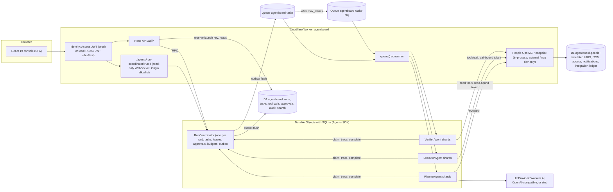

# AgentBoard

AgentBoard is an operations console for launching, monitoring and controlling agent runs that serve a **simulated** People-operations organization. A planning agent turns a request (an address change, an onboarding, an offboarding, a privileged grant) into a plan; an executor and a verifier carry it out through an MCP server; a per-run coordinator owns the shared task state, leases, budgets, approvals and a hash-chained audit trail. It is built on Cloudflare Workers with the Agents SDK, Durable Objects, Queues, D1 and MCP, with a React and TypeScript console.

**Everything People-related is simulated.** The HRIS, ITSM, access-management and notification systems are tables in a separate D1 database, filled with 60 fictional employees by a seeded generator. There are no real users, employees or HR systems behind it in any environment, production included.

**Nothing is deployed.** Every measured number in this README was produced locally by this repository's own scripts. Deploy steps are below; production behavior has not been measured.

The design is in [`SPEC.md`](SPEC.md), the domain terms in [`CONTEXT.md`](CONTEXT.md), the main decisions in [`docs/adr/`](docs/adr) (coordinator leases and queues, the integration ledger and call-bound tokens, policy-owned approvals with gating edges, derived run status with recovery cascades, measured results with a staleness check), and the milestone demo scripts in [`demos/`](demos).

## Architecture



How one run flows:

```mermaid
sequenceDiagram
  participant Op as Operator
  participant API as Hono API
  participant RC as RunCoordinator
  participant Q as Queue
  participant P as Planner
  participant E as Executor
  participant M as People Ops MCP
  participant V as Verifier
  participant Ap as Approver
  Op->>API: POST /api/runs (clientRequestId)
  API->>API: reserve (requester, clientRequestId) in D1
  API->>RC: initRun (idempotent)
  RC->>Q: dispatch plan task (outbox)
  Q->>P: claim lease, tools/list, plan with one repair
  P->>RC: completeTask(plan)
  RC->>RC: validate, apply approval policy, gating edges, materialize tasks
  RC->>Q: dispatch ready execute tasks
  Q->>E: claim lease, call-bound token
  E->>M: tools/call with idempotency key
  E->>RC: appendTrace, completeTask
  RC->>Q: dispatch verify task
  Q->>V: read tools, check the postcondition
  Note over RC: an approval-gated step waits; every later write depends on it
  Ap->>API: approve or reject
  API->>RC: resolveApproval (separation of duties, expiry)
  RC-->>Op: snapshot pushed over WebSocket after every commit
```

The rules that make it safe under at-least-once delivery:

- **One writer per run.** Agents never call each other; they claim, trace and complete only through the run's coordinator. Every coordinator RPC is one `transactionSync` that sweeps expired leases, approvals and deadlines, applies the operation, re-derives the run status, and writes rows, hash-chained audit events and outbox entries. Nothing inside it awaits.
- **Leases with fencing.** A claim is granted only for the task's current `dispatchId`; a redelivery of a live dispatch is refused `in_flight`, a superseded one `stale_dispatch`. Completions and traces carry the lease epoch, and one report per lease is accepted. The sweep, not a timer, reaps expired leases; the Agents SDK `schedule()` only wakes the coordinator.
- **Call-bound integration tokens.** After each lease grant the coordinator mints an HS256 token bound to that one call (tool, canonical arguments hash, idempotency key, run, task, step, epoch, lease expiry). The MCP endpoint and every tool handler check it.
- **An integration ledger.** Writes apply at most once per plan step, across retries and generations: ownership-guarded, correlation-guarded D1 batches, lock takeover, and logical replay of an earlier generation's result.
- **Only reads before an approval.** Gating edges make every other write depend on the approval-gated step's verification, so a rejection never leaves a write behind. Rejection does not compensate steps that already ran; by construction only reads run before an approval gate.

## What runs where

| Capability | Local (this repo, offline) | Production or preview (after a Cloudflare login) |
|---|---|---|
| Worker, Hono API, static assets | workerd via `@cloudflare/vite-plugin` (`npm run dev`), `wrangler dev` on the built output (`npm run serve:built`, `eval:sim`), or Miniflare in vitest | Cloudflare Workers with static assets (not deployed) |
| Agents (SQLite Durable Objects) | local SQLite Durable Objects | Durable Objects |
| Lease, approval and deadline wakes | Agent `schedule()` on Durable Object alarms (one-second granularity) plus the sweep on every RPC; tests use an injected clock | same code on Durable Object alarms |
| Queues and DLQ | local queues | Cloudflare Queues |
| D1 (console and simulated People systems) | local SQLite in `.wrangler/` | D1 |
| History search | D1 FTS5 | D1 FTS5 (same code) |
| Identity | `AUTH_MODE=dev`: RS256 JWTs from a locally generated key, verified by the same code as Access; dev login on loopback only | Cloudflare Access JWT in `Cf-Access-Jwt-Assertion` against the team JWKS (verified locally only against an intercepted JWKS) |
| LLM planning | deterministic stub in tests and the simulation; a local llama-server (Qwen3-1.7B Q4_0) for `eval:planner` | Workers AI `@cf/qwen/qwen3-30b-a3b-fp8` through AI Gateway (unit-tested with a fake binding only; never executed) |
| MCP integrations | in-process Streamable HTTP to the simulated People systems; an external `/mcp` route for MCP Inspector only with `MCP_EXTERNAL=on` on loopback | the same in-process path to the same simulated systems; no external route (`MCP_EXTERNAL=on` is refused at load time) |
| Fault directives (simulation) | on in tests and the simulation | off, enforced at load time |
| Preview deployments | not applicable | `preview.yml` deploys each pull request to the shared `preview` environment once the Cloudflare secrets exist (never run; checked offline with `wrangler deploy --dry-run`) |
| Numbers in this README | all of them | none |

## Local setup

Requires Node 24 or newer and no Cloudflare login. `.nvmrc` pins Node 24 for CI, which has not run yet (nothing is pushed); every local run in this repository, including the measurements below, used Node 25.9.

1. `nvm use && npm ci`
2. `npm run dev:keys` writes `.dev.vars` with a local RS256 dev keypair and an integration signing key (gitignored).
3. `npm run db:migrate:local && npm run db:seed:local`
4. `npm run dev`, open `http://127.0.0.1:5173/dev/login` and pick a seeded principal. Or run the built worker: `npm run serve:built -- --fresh`, then open `http://127.0.0.1:8784/dev/login`.
5. `npm test` and `npm run test:sim`.
6. Optional: `npm run llm:serve` in another terminal, then `npm run eval:planner`; and `npm run eval:sim`.

A bare `wrangler dev` is **unsupported**. Against `wrangler.jsonc` it fails, because the `assets` block has no `directory` (the Vite plugin supplies it at build time); after any `vite build` it would follow `.wrangler/deploy/config.json` to whatever `dist/` holds, which may be stale or a production build. `serve:built` and `eval:sim` build first, assert the built config is the local one, and pass `--config dist/agentboard/wrangler.json` with an absolute `--env-file`.

With the stub planner (the local default), only the synthetic dataset's requests can be planned; the launch form offers them as dev-only samples.

### Inspecting the MCP server (development only)

The agents reach the People Ops MCP server in-process; by default the worker answers 404 on `/mcp`. For debugging with MCP Inspector, add `MCP_EXTERNAL=on` to `.dev.vars` and restart `npm run dev` or `npm run serve:built` (the config loader refuses the flag outside development, and the route answers only on loopback hosts). Then mint a token:

```sh
npm run dev:token -- --integration --tool hris.get_employee --args '{"employeeId":"E-1001"}'
```

It is bound to that one read tool and those exact arguments for 60 seconds; write tools are refused. Connect MCP Inspector over Streamable HTTP through its local proxy (the route sends no CORS headers) to `http://127.0.0.1:8784/mcp` (`serve:built`) or `http://127.0.0.1:5173/mcp` (`npm run dev`), with the token as the bearer token. Checked with curl against the built worker (initialize, tools/list, the bound call, a refused call with other arguments, 401 without a token, 404 for a non-loopback host); MCP Inspector itself was not run here.

## Deploy (not done; needs an account)

1. `npx wrangler login`
2. `npx wrangler d1 create agentboard` and `npx wrangler d1 create agentboard-people`; put the ids into `env.production`.
3. `npx wrangler queues create agentboard-tasks` and `npx wrangler queues create agentboard-tasks-dlq`.
4. Create AI Gateway `agentboard` in the dashboard (or set `AI_GATEWAY_ID` to an empty string).
5. `openssl rand -base64 48 | npx wrangler secret put INTEGRATION_SIGNING_KEY --env production`
6. `npx wrangler d1 migrations apply agentboard --remote --env production` and the same for `agentboard-people`; seed with `npx wrangler d1 execute agentboard-people --remote --env production --file seed/people.sql`; create the admin binding with `node scripts/bootstrap-admin.ts --email <you>` and execute its SQL with `--env production`.
7. `npm run deploy` (`CLOUDFLARE_ENV=production vite build && wrangler deploy`).
8. Zero Trust: create a self-hosted Access application for the `workers.dev` hostname, allow your identity, copy the AUD tag and team domain into `env.production` vars, set `ALLOWED_ORIGINS` to the hostname, redeploy.
9. Open the URL, authenticate, confirm `/api/me` shows `admin`.
10. A preview environment repeats steps 2 to 8 with `--env preview` on every `wrangler d1`, `wrangler queues` and `wrangler secret` command and the `-preview` names (`agentboard-preview`, `agentboard-people-preview`, `agentboard-preview-tasks`, `agentboard-preview-tasks-dlq`), deploying with `npm run deploy:preview`. Cloudflare does not generate preview URLs for Workers that implement Durable Objects, so there is one shared preview Worker, `agentboard-preview`.
11. Per-PR preview deployments: add the `CLOUDFLARE_API_TOKEN` and `CLOUDFLARE_ACCOUNT_ID` repository secrets. `.github/workflows/preview.yml` then applies new D1 migrations to the preview databases, builds with `CLOUDFLARE_ENV=preview`, refuses any built config that is not the preview one, and deploys every pull request to `agentboard-preview`, one deploy at a time. Without the secrets (and on pull requests from forks) it skips the deploy job. It has not run against a real account.

The top-level configuration is the local one and has `workers_dev: false`, so an accidental top-level deploy is unreachable; production refuses dev auth, fault injection, the stub LLM and a short signing key at load time.

## Tests

- `npm test` runs five projects: `worker` (workerd), `worker-ws` (WebSockets, isolation off as the Cloudflare known-issues page requires), `worker-access` (production Access verification against an intercepted JWKS), `web` (React components in happy-dom) and `node` (script math and launchers).
- `npm run test:sim` drives all 100 synthetic requests through the real API, queue, coordinator, agents and MCP tools in workerd, with the same driver as `eval:sim`.
- Exactly 100 tests are tagged `orchestration` or `authz` (SPEC section 13.1). `npm run count:tests` counts them with `vitest list --tags-filter` and runs them for pass counts; CI checks the README against the count. The other tests (search, MCP tools and the dev-only `/mcp` route, LLM providers, the data generator, 16 React component tests, eval math, launchers and the toolchain gate) carry their own tags and are not part of the 100.
- `.github/workflows/ci.yml` runs on every branch push and pull request: `types:check`, `typecheck`, `synth:check`, `npm test`, `test:sim`, `count:tests -- --check`, `results:check` and `build`, then prints the worker bundle size. It has not run on GitHub yet. `preview.yml` and `release.yml` are described under Deploy and Releases.

## Releases

Four milestone tags, `v0.1.0` to `v0.4.0`, exist in this repository with a demo script each in `demos/` and a section each in `CHANGELOG.md`; no GitHub release has been published yet. `.github/workflows/release.yml` publishes one: pushing a `v*` tag runs the full CI workflow on the tagged commit, then creates the release with the tag's changelog section and its demo script as notes. The four existing tags predate the workflow (GitHub runs the workflow file of the tagged commit), so their releases are created by running it by hand, for example `gh workflow run release.yml -f tag=v0.1.0`; an existing release is left untouched.

## Results

Every number below is written by a script into `eval/results/*.json` and rendered here by `npm run results:render`. CI (`npm run results:check`) fails if this block differs from the JSON, if a measurement ran on a dirty tree, or if the measured code changed after the measurement. Measurement dates are UTC.

<!-- RESULTS:START -->

### Simulation (100 synthetic runs, local)

Command: `npm run eval:sim` (wrangler dev on the built worker: local workerd, local D1, local queues; stub planner). Measured 2026-10-09 at commit `c29b802`.

| Metric | Value |
|---|---|
| Runs executed | 100 |
| Outcome distribution | awaiting_approval 3, cancelled 4, rejected 6, succeeded 87 |
| Outcome match (measured status equals expected) | 100/100 |
| Duplicate side effects (per idempotency key) | 0 |
| Logical duplicate side effects (per run and step) | 0 |
| Tool calls | 575 (ok 544, permanent_error 4, replayed 6, retryable_error 21) |
| Ledger replays (of which logical) | 6 (0) |
| Task retries; runs recovered by retry | 21; 18 |
| Lease expiries; recovered | 6; 6 |
| Refused duplicate or stale deliveries | 10 |
| Approvals requested; approved, rejected, pending | 45; 36, 6, 3 |
| Budget exhaustions; recoveries | 3; 3 |
| Silent no-ops detected by the verifier; false positives | 4/4; 0 |
| Recovery actions | approval.decided 42, budget.raised 3, run.cancelled 4, run.paused 3, run.resumed 3, task.retried 8, task.skipped 4 |
| Audit events; runs with a valid hash chain | 3230; 100/100 |
| Search known-item smoke check (20 queries) at 1; at 5 | 20/20; 20/20 |
| Run duration p50; p95 (local wall clock) | 7234 ms; 10952 ms |
| Search latency p50; p95 (local) | 5 ms; 7 ms |

This distribution is fixed by the dataset design; outcome match is the measured agreement. It is not a success rate. The known-item search check is a smoke test of indexing and ranking (each query is unique by construction), not a retrieval-quality benchmark.

### Planner (local model)

Command: `npm run eval:planner` against llama-server (0.5.0 (build 11146, commit 7fe450e19)) serving `Qwen3-1.7B-Q4_0-rtn.gguf` (Q4_0) with `-np 1 -c 8192 -ngl 99 --reasoning off --jinja`, temperature 0, seed 7, one request at a time. Measured 2026-10-09 at commit `c29b802`.

| Metric | Value |
|---|---|
| Valid plans, first pass | 84/100 (84%) |
| Valid plans after one repair | 84/100 (84%) |
| Invalid after the repair; requests that failed at the transport (timeout or connection) | 16; 0 |
| Plans rejected for policy violations | 0 |
| Tool sequence exactly equal to gold | 9/100 (9%) |
| Tool-set F1 (macro) | 0.593 |
| Argument accuracy (gold fields of matched steps) | 1.000 |
| Unknown-tool rate | 0.000 |
| Latency p50; p95 | 941 ms; 9997 ms |
| Prompt tokens p50; max | 817; 1368 |

### Tests

Command: `npm run count:tests`. Measured 2026-10-09 at commit `c29b802`.

Tagged tests: 61 orchestration + 39 authorization = 100; passing: 100.

### Production

Not measured. Nothing has been deployed; every number above comes from local runs.

<!-- RESULTS:END -->

Reading the results:

- The simulation uses the deterministic stub planner, so it measures orchestration (leases, retries, replays, approvals, budgets, recovery, audit, search indexing), not planning quality.
- Some safety paths never fire in the simulation by design: no scenario re-runs a write that really applied, so logical replays stay at zero there, and no infrastructure failure exhausts queue retries, so the DLQ stays empty. Both paths are covered by tests (`idempotency.test.ts` #8, `retries.test.ts` #5 and #6).
- Planner argument accuracy is computed only over gold steps the model got right by tool and position, which with this small model are mostly the opening read steps. Read it together with exact match and tool-set F1, which show how far the plans are from the gold sequences.
- Planning quality of the production model (Workers AI) is not measured.

## Limitations and claim boundaries

- The People organization, its systems and its employees are simulated. Nothing here has served real users.
- Only the planner calls a model. The executor and verifier are deterministic Agents SDK Durable Objects by design.
- The 100-run simulation uses the stub planner; planning quality is measured separately by `eval:planner` against a small local model. Workers AI and AI Gateway are untested here (no account).
- Every class runs in one Worker that holds the integration signing key, so call-bound tokens defend against confused or buggy call paths (wrong tool, tampered arguments, replay into another task or after the lease), not against arbitrary code running inside the Worker.
- Rejection does not compensate steps that already ran; by construction only reads run before an approval gate.
- Local latencies come from `wrangler dev` on a laptop and say nothing about production.
- D1 export does not support FTS5 virtual tables: to back up, drop `search_fts`, export, recreate it, then rebuild with `INSERT INTO search_fts(search_fts) VALUES('rebuild')`.

## License

MIT
