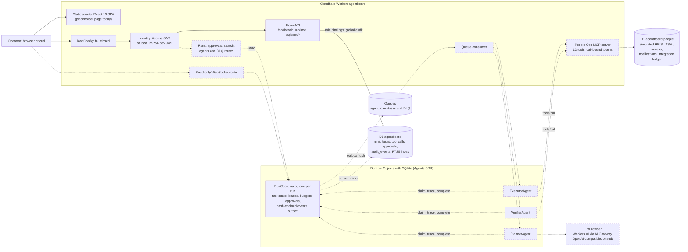

# AgentBoard

An operations console on Cloudflare Workers for launching, monitoring and controlling AI agent runs that carry out People-operations requests. A coordinator per run owns the task state, leases, approvals and a hash-chained audit trail.

**All People data and systems are simulated.** The HRIS, ITSM, access-management and notification systems are tables in a separate D1 database, filled by a seeded generator with 60 fictional employees. No real person, employee record or HR system sits behind AgentBoard in any environment. Nothing is deployed yet.

## Status

> **v1 is in active development.** Milestone 1 of 4 is done. The orchestration core is being built one commit at a time from [`SPEC.md`](SPEC.md). [`PROGRESS.md`](PROGRESS.md) is the live position: which commit of the plan is done, the last check results, and every deviation from the spec with its reason.

| Milestone | Commits | State |
|---|---|---|
| 1. Foundations: toolchain, schemas, synthetic data, config, identity | 1 to 8 | Done, tagged `v0.1.0` |
| 2. Orchestration core: coordinator, dispatch, MCP, LLM providers, agents, approvals | 9 to 22 | In progress: commits 9 to 11 done |
| 3. Console: HTTP API, search, realtime, web pages | 23 to 30 | Not started |
| 4. Simulation, evaluation and release | 31 to 36 | Not started |

**Works today** (commit `ee135f9`):

- The Worker runs in workerd under Vite and serves `/api/health`, `/api/me` and loopback-only dev routes. Requests pass through a fail-closed config loader, Access JWT verification, a default-deny role matrix and a CSRF guard.
- Both D1 schemas migrate and seed locally, and the synthetic dataset regenerates byte for byte.
- `RunCoordinator` implements:
  - the run and task state machines, with derived run status
  - approval requests
  - dispatch fencing, and leases with fencing epochs
  - an expiry sweep inside every transaction, plus a scheduled wake
  - call-bound integration tokens minted after each lease grant
  - per-run execution budgets
  - recovery commands with cascades

  Every RPC is one synchronous transaction that writes hash-chained events and queue outbox rows. Tests drive the coordinator directly; no API route or queue consumer calls it yet.
- **Tests: 45 passing in 10 files** (22 tagged `orchestration`, 12 `authz`, 6 `data`, 5 `tooling`), measured by running `npm test` on commit `ee135f9` on 2026-10-08 (about 9 seconds locally). `typecheck`, `types:check`, `synth:check` and `build` also pass on that commit.

**Still to come:** the outbox flush to Queues and D1, the queue consumer, the People Ops MCP server and integration ledger, LLM providers, the three role agents, approval decisions, the run, approval, search, agent and DLQ API, live WebSocket updates, the console pages, the 100-run simulation and the evals. Today the web app is a placeholder page. See the [Roadmap](#roadmap).

## Why

A People/Places organization handles a steady stream of requests that each touch several systems. A manager change updates the HRIS and notifies the employee. An offboarding sets employment status, revokes every access grant, opens a laptop-return ticket and sends a notice. Agents can do this work, but only if the platform around them can answer questions that matter more than the model:

- Who approved the risky step, and could the requester approve their own request?
- If a queue redelivers a message or a worker crashes mid-call, is the change applied twice?
- Can an operator see exactly which tool calls ran, then pause the run, retry one step or skip a notification?
- Is the audit trail tamper-evident?
- Does each agent hold a credential for only the one call it is making?

AgentBoard is that control plane. Agents plan, execute and verify. A coordinator per run owns the state and enforces leases, budgets and approval gates. People keep the decisions. Every transition lands in a hash-chained audit stream.

## Features

### Implemented

- **Fail-closed configuration.** Every variable is parsed with zod. Production and preview must use Access auth, fault injection off, a non-stub LLM and `https://` origins. Lease timing invariants guarantee that no external call can outlive its lease (`LEASE_TTL_MS >= 2 * TOOL_TIMEOUT_MS + 1000`, and similar rules for the planner and the integration lock). A bad config answers `500 misconfigured` on every API path and retries every queue message.
- **Identity.** The Cloudflare Access JWT is read from `Cf-Access-Jwt-Assertion` only and verified with RS256, issuer, audience, a 30-second clock tolerance and a memoized team JWKS. Dev and test run the same verifier against a locally generated JWKS. Access service tokens map to `svc:<name>` principals.
- **Dev login, loopback only.** `POST /api/dev/login` and `GET /api/dev/users` exist only in dev auth mode and answer 404 to non-loopback hosts. The dev server refuses a non-loopback `--host`. `npm run dev:token` prints a JWT for curl.
- **Authorization.** Four roles (viewer, operator, approver, admin), 15 permissions, default deny. A principal without a role binding can call only `/api/me`.
- **CSRF guard.** Mutations need `Content-Type: application/json` and `X-AgentBoard-Client: web`. Together they force a CORS preflight, and `/api` never sends CORS headers. A foreign `Origin` is refused outright.
- **D1 schemas.** The console database holds runs, tasks, tool calls, approvals, DLQ messages, agent controls, role bindings, an append-only `audit_events` table (update and delete triggers abort) and an FTS5 search index. The People database holds employees, tickets, access grants, notifications, the integration's idempotency ledger and a side-effect log.
- **Global audit stream.** D1 events are hash-chained, with `UNIQUE(stream, seq)` and a re-read and retry when another writer wins the race. Dev login writes to it today.
- **Synthetic data generator.** It is seeded, pure and byte-stable, with a committed sha256. It writes the dataset and both seed SQL files. See [Data](#data).
- **Plan validation and materialization.** Pure TypeScript with no Workers APIs:
  - a tool registry with 12 zod argument schemas
  - per-request-type tool allowlists
  - subject pinning (every `employeeId` must be the request's subject)
  - an approval policy decided in code
  - a task graph with approval gating edges and a cycle check

  The LLM prompt and repair loop come in commit 17.
- **RunCoordinator state machine:**
  - idempotent `initRun`
  - plan acceptance and materialization
  - readiness promotion and approval requests
  - run status derived with a fixed precedence
  - the claim refusal ladder (`duplicate`, `stale_dispatch`, `held`, `budget_exhausted`, `not_ready`, `in_flight`)
  - lease epochs, one accepted completion per lease and fenced traces
  - recovery commands: pause, resume, cancel, retry, skip, release lease, raise budget, role hold and release, dead-letter and replay. Retry and skip cascade to the verify task.
  - hash-chained per-run events in Durable Object SQLite
  - a viewer-redacted snapshot broadcast after each commit
- **Lease expiry without trusting timers.** A synchronous, idempotent sweep runs at the start of every coordinator transaction and in `onStart`. It reaps expired leases (releasing their tool-call reservation, then redispatching with a new `dispatchId`, or failing the task when attempts are exhausted) and expires pending approvals. After each commit, one wake is armed with `schedule()` at the ceiling second of the next deadline.
- **Call-bound integration tokens, minted.** After a grant, the coordinator signs an HS256 token bound to the leased task and the lease expiry:
  - executor tokens carry the tool, the canonical args hash and the idempotency key
  - verifier tokens carry the read tools, the subject and the result refs
  - planner tokens can only read the catalog

  The MCP endpoint that checks these tokens is commit 14.
- **Execution budgets.** Per-run limits: `maxSteps`, `maxToolCalls` (calls made plus outstanding reservations), `maxLlmTokens` (a planner claim needs 1500 left), `maxAttemptsPerTask` and `maxActiveMs` (queued, planning and running time only). A claim that would exceed a budget leaves the task `budget_blocked` and the run `needs_attention` until an admin `raise_budget`. Usage changes only inside fenced, deduplicated transactions, so a duplicate report or trace never double counts.

### Planned

| Feature | Commit |
|---|---|
| Transactional outbox flush to Queues, D1 mirrors of runs, tasks and approvals, per-run audit in D1 | 12 |
| Queue consumer: sharded dispatch, role-agent skeleton, backoff, dispatch-fenced DLQ, bounded batch concurrency (until then the consumer retries every message) | 13 |
| People Ops MCP server with 12 tools and call-bound token checks inside every handler | 14 |
| Integration ledger with lock takeover and per-step logical dedupe, dev-only fault directives | 15 |
| LLM providers: Workers AI through AI Gateway, OpenAI-compatible (local llama.cpp) and a deterministic stub | 16 |
| `PlannerAgent`, `ExecutorAgent`, `VerifierAgent` (the classes exist today as empty skeletons) | 17 to 19 |
| Approval decisions with separation of duties and expiry | 20 |
| Agent-role disable and enable, and DLQ replay, end to end (the coordinator commands already exist) | 21 |
| Launch reservation, and the run, tool-call, timeline, approval, agent and DLQ endpoints with redaction | 23 |
| FTS5 search API with bm25 ranking and snippets (the index tables already exist) | 24 |
| Live run snapshots over a read-only WebSocket with an Origin allowlist | 25 |
| Console pages: Dashboard, Runs with search, Run detail, Approvals, Launch, Dev login | 26 to 29 |
| 100-run simulation, `eval:sim`, `eval:planner`, tagged-test counter, rendered results | 31 to 34 |

## Architecture



Solid boxes and arrows are in the code at commit `ee135f9`. Dashed ones are designed in [`SPEC.md`](SPEC.md) section 3 and not built yet. The queue bindings already exist in `wrangler.jsonc`. The four agent classes are declared from the start so the Durable Object migration never changes, but the three role agents are empty skeletons.

How one run will flow once milestone 2 lands (SPEC section 3.2):

1. `POST /api/runs` reserves `(requester, clientRequestId)` in D1, then `RunCoordinator.initRun` dispatches the plan task.
2. `PlannerAgent` claims the plan task, reads the tool catalog over MCP and asks the LLM for a JSON plan. The coordinator re-validates the plan and materializes execute and verify tasks with gating edges (this step is implemented).
3. `ExecutorAgent` claims each ready execute task and makes one MCP call with a token bound to that call. `VerifierAgent` checks the postcondition through read-only tools.
4. An approval-gated step waits in `awaiting_approval` until an approver decides. The approver cannot be the person who requested the run.
5. After every commit, the coordinator broadcasts a snapshot to read-only WebSocket clients.

Agents never call each other. They coordinate only through `claimTask`, `appendTrace` and `completeTask` on the run's coordinator.

## Key design decisions

### One writer per run, one transaction per RPC (implemented)

Each run has its own `RunCoordinator` Durable Object. It is the only writer of that run's tasks, leases, approvals and events. Every RPC runs inside a single `ctx.storage.transactionSync`, and nothing inside the transaction awaits:

```
load run -> sweep -> derive status -> operation -> promote ready tasks
         -> derive status -> dispatch -> persist rows, hash-chained events, outbox rows
after commit: setState(snapshot), arm the next wake   // broadcast only what committed
```

A Durable Object can deliver other requests while one is awaiting I/O. Keeping every read-modify-write of task state inside one synchronous transaction removes that class of race.

### Run status is derived, never set (implemented)

No command writes a run status. `deriveRunStatus()` recomputes it at the end of every transaction with a fixed precedence: terminal states stay terminal, then rejected, cancelled, paused, needs attention, queued or planning (until the plan succeeds), awaiting approval, succeeded, and otherwise running. `cancel` and `pause` set flags that the derivation reads. A retry or skip therefore moves the run forward without code that has to remember to update the status.

### Fencing at every hop (implemented in the coordinator; queue side in commit 13)

- Every dispatch carries a fresh `dispatchId`. A claim with a superseded id is `stale_dispatch`, and a redelivery of the live dispatch is `in_flight`.
- Every lease grant increments an epoch. Traces and completions must carry the current lease id and epoch, so a zombie holder of an older lease is refused (`stale_lease`).
- Each lease gets exactly one accepted completion (`ab_reports`).

### A sweep, not timers, enforces expiry (implemented)

The Agents SDK `schedule()` is async, so it cannot run inside a synchronous transaction. It also floors a `Date` to whole seconds. Lease, approval and active-time expiry are therefore enforced by a synchronous, idempotent sweep that runs at the start of every coordinator transaction and in `onStart`. `schedule()` is only a wake: it is armed after commit at the ceiling second, with an idempotent `{ at }` payload. Correctness never depends on the wake firing on time.

The tests cover three cases:

- the sweep driven by an injected clock
- the crash window: a lease granted with no wake armed is reaped by the next RPC, or by `onStart` after eviction
- one real alarm

### Idempotency in layers (partly implemented)

- **Implemented:** dispatch and lease fencing (above), one report per lease, and a deterministic idempotency key `ik_ + base64url(sha256(runId | stepId | generation | tool | canonicalJson(args)))`. The key is stable across attempts and epochs and changes only when an operator retry bumps the generation.
- **Implemented in the schema, logic planned:** the launch key `UNIQUE(requester, client_request_id)` (commit 23), and the People DB `idempotency` ledger and `side_effects` log (commit 15). A write's effect is applied in one guarded D1 `batch()`, conditioned on still owning the ledger row and on no effect existing yet for `<runId>:<stepId>`. A step therefore applies at most once across all retry generations, even after a lock takeover.

### Approval gates are graph edges (implemented)

When any step needs approval, the materializer makes every other write step depend on the gated step's verify task, whatever order the plan used. Only reads can run before an approval, so a rejection never leaves a write applied. Approval policy and risk come from `policy.ts`, never from the model. A plan that names a tool outside the request type's allowlist, or targets another employee, is rejected rather than shown to an approver: showing an approver an injected destructive step is itself a social-engineering path.

### One auth code path in every environment (implemented)

Production verifies Cloudflare Access JWTs against the team JWKS. Dev and test verify RS256 JWTs from a locally generated key with the same function. Production can never run dev mode, because the config loader refuses it. The top-level `wrangler.jsonc` has `workers_dev: false`, so an accidental deploy is unreachable. Dev routes refuse non-loopback hosts, and the dev server refuses to bind anywhere but loopback.

### Call-bound integration tokens (minting implemented; checks at the MCP layer in commit 14)

After granting a lease, the coordinator mints a short-lived HS256 token bound to one tool, the canonical args hash, the idempotency key, the run, step, task, lease epoch and lease expiry. The MCP endpoint and every tool handler will check those bindings. A token minted for `hris.update_address` cannot call `hris.set_employment_status`, change its arguments, or be replayed into another task or after its lease. The stated limit: every class runs in one Worker that holds the signing key. The binding defends against confused or buggy call paths, not against arbitrary code inside the Worker.

### Provider interfaces with local fallbacks (planned, commit 16)

The planner talks to an `LlmProvider` interface (`generate(request, signal)` returning text, provider-reported usage, latency, provider and model). There are three implementations:

- Workers AI through AI Gateway in production
- an OpenAI-compatible client for a local llama.cpp server, used by the planner eval
- a deterministic stub keyed by prompt hash, used in tests and the simulation

Only the planner calls a model. The executor and verifier are deterministic by design, so a model never decides whether a write happened.

## Tech stack

Exact versions pinned in `package.json`.

| Area | Packages |
|---|---|
| Runtime | Cloudflare Workers (workerd), compatibility date `2026-09-30`, `nodejs_compat` |
| Agents and Durable Objects | `agents` 0.27.0 |
| API | `hono` 4.13.13, `@hono/zod-validator` 0.9.1, `zod` 4.6.5 |
| Auth and tokens | `jose` 6.2.12 |
| MCP (pinned, used from commit 14) | `@modelcontextprotocol/server` 2.0.0, `@modelcontextprotocol/client` 2.0.0, `@modelcontextprotocol/sdk` 1.30.0 (only to satisfy the `agents` peer) |
| Web | `react` 19.3.0, `react-dom` 19.3.0, `react-router` 7.18.4 (pinned, used from commit 26) |
| Build | `vite` 8.3.4, `@vitejs/plugin-react` 6.1.2, `@cloudflare/vite-plugin` 1.63.1, `wrangler` 4.149.0 |
| Language | `typescript` 6.0.3 (strict, `noUncheckedIndexedAccess`, `exactOptionalPropertyTypes`), `@types/node` 24.19.1, `@types/react` 19.3.0, `@types/react-dom` 19.3.0 |
| Tests | `vitest` 4.1.11, `@cloudflare/vitest-plugin` 1.4.0, `happy-dom` 20.14.5, `@testing-library/react` 16.3.3, `@testing-library/dom` 10.4.2 |
| Node | 24 (`.nvmrc`); `engines` allows `>=22.12`; Node 25.9 also verified |

## Getting started

Everything runs offline. No Cloudflare account is needed.

```sh
nvm use                     # Node 24 from .nvmrc
npm ci

npm run synth:check         # optional: regenerate the dataset in memory and compare with the committed bytes
npm run dev:keys            # writes .dev.vars: RS256 dev keypair and integration signing key
npm run db:migrate:local    # applies both D1 migration sets to local SQLite in .wrangler/state
npm run db:seed:local       # 9 principals, 3 agent roles, 60 employees, 180 access grants
npm run dev                 # Vite + workerd on http://127.0.0.1:5173

npm test                    # in another terminal
npm run build
```

Try the API while `npm run dev` is running:

```sh
curl -s http://127.0.0.1:5173/api/health
# {"ok":true,"version":"0.0.0","environment":"development","authMode":"dev","llmProvider":"stub","faultInjection":true}

curl -s -H "Cf-Access-Jwt-Assertion: $(npm run -s dev:token -- --principal ops.lead@agentboard.test)" \
  http://127.0.0.1:5173/api/me
# role "operator" and its 10 permissions

curl -s -o /dev/null -w '%{http_code}\n' http://127.0.0.1:5173/api/me
# 401 without a token

curl -s -X POST http://127.0.0.1:5173/api/dev/login \
  -H 'Content-Type: application/json' -H 'X-AgentBoard-Client: web' \
  -d '{"principal":"admin@agentboard.test"}'
# {"principal":"admin@agentboard.test","role":"admin"} and a CF_Authorization cookie
```

The seeded principals are listed by `GET /api/dev/users`. [`demos/milestone-1.md`](demos/milestone-1.md) walks through the same checks.

**`.dev.vars`.** [`.dev.vars.example`](.dev.vars.example) documents the three local secrets: `INTEGRATION_SIGNING_KEY`, `ACCESS_DEV_JWKS` and `DEV_ACCESS_PRIVATE_JWK`. `npm run dev:keys` fills them with freshly generated values and refuses to overwrite an existing `.dev.vars` unless you pass `--force`. The file is gitignored. Without it the config fails closed, and every API request answers `500 misconfigured`.

**Ports.** `npm run dev` binds `127.0.0.1:5173` with `strictPort`. `npm run preview` serves the last build on `127.0.0.1:4173`. The workerd inspector is pinned to 9234.

**A bare `wrangler dev` is unsupported.** The top-level `wrangler.jsonc` has an `assets` block without `directory` because the Vite plugin supplies it at build time, so wrangler refuses the file. After a `vite build`, wrangler would follow `.wrangler/deploy/config.json` to whatever `dist/` holds. Use `npm run dev` or `npm run preview`.

All scripts that exist today:

| Script | What it does |
|---|---|
| `npm run dev` | Vite dev server with the Worker in workerd (HMR) |
| `npm test` | Vitest projects `worker`, `worker-ws`, `worker-access`, `node` |
| `npm run typecheck` | `tsc -b` over the worker, web, test and node projects |
| `npm run types` / `types:check` | Generate or check `worker-configuration.d.ts` with `wrangler types` (reads `.dev.vars.example`, never your `.dev.vars`) |
| `npm run synth` / `synth:check` | Write or verify the synthetic dataset, its checksum and both seed files |
| `npm run dev:keys` | Write `.dev.vars` with local keys |
| `npm run dev:token -- --principal <id>` | Print a dev JWT for `Cf-Access-Jwt-Assertion` |
| `npm run db:migrate:local` / `db:seed:local` | Apply migrations and seeds to the local D1 databases |
| `npm run build` | Build the client and the Worker into `dist/` (local configuration) |
| `npm run build:prod` | Build with the `production` Wrangler environment (offline; deploying is a separate step) |
| `npm run preview` | Serve the last build locally |

CI ([`.github/workflows/ci.yml`](.github/workflows/ci.yml)) runs `npm ci`, `types:check`, `typecheck`, `synth:check`, `npm test` and `build` on every push and pull request.

## Local versus production

**Nothing is deployed.** No Cloudflare account was used to build or test this repository. Every check runs offline in workerd and Miniflare. Deploying needs a Cloudflare login (`npx wrangler login`) and these steps:

- create the two D1 databases and two queues
- create the AI Gateway
- set `INTEGRATION_SIGNING_KEY` as a secret
- create an Access application
- replace the placeholder IDs and Access values in `env.production`

The `deploy` script and the step-by-step deploy guide are part of the remaining plan (SPEC section 18).

| Cloudflare service | Role in AgentBoard | Local stand-in | Production | State |
|---|---|---|---|---|
| Workers + static assets | Hono API and the React SPA | workerd through `@cloudflare/vite-plugin` (`npm run dev`, `npm run preview`) and Miniflare in vitest | Worker `agentboard-production` on `workers.dev` | Implemented locally |
| Durable Objects (SQLite, Agents SDK) | `RunCoordinator` per run; sharded planner, executor and verifier agents | Miniflare Durable Objects with local SQLite | Durable Objects | Coordinator implemented; role agents planned |
| Queues | Task dispatch and the dead-letter queue | Miniflare local queues | `agentboard-tasks`, `agentboard-tasks-dlq` | Bindings configured; consumer planned |
| D1 | Console history and audit; simulated People systems | Local SQLite in `.wrangler/state` | Two D1 databases | Implemented |
| Access | Operator identity | RS256 JWTs from a locally generated key, same verifier; dev login on loopback only | Access JWT verified against the team JWKS | Implemented; the remote JWKS path is tested only against an intercepted fetch |
| Workers AI | Planner model | Stub provider in tests and the simulation; llama.cpp with Qwen3-1.7B Q4_0 for the planner eval | `@cf/qwen/qwen3-30b-a3b-fp8` | Planned (commit 16) |
| AI Gateway | Routing and logging for Workers AI calls | None | Gateway `agentboard` | Planned (commit 16) |
| AI Search | Not used | n/a | History search is D1 FTS5 in every environment; FTS5 is the production implementation, not a stand-in | n/a |
| Workflows | Not used | n/a | The coordinator already owns per-task leases, fencing and operator recovery; Workflows would duplicate retry semantics | n/a |
| R2 | Not used | n/a | No object storage in v1 | n/a |
| Secrets | `INTEGRATION_SIGNING_KEY` | `.dev.vars` from `npm run dev:keys` | `wrangler secret put INTEGRATION_SIGNING_KEY --env production` | Config implemented |

The `ai` binding exists only under `env.production` and `env.preview`. An `ai` binding always uses a remote proxy, which would break offline development and tests.

## Data

Every person, department, system and request is synthetic. The generator ([`src/shared/synth/generator.ts`](src/shared/synth/generator.ts)) is pure and seeded (`sfc32`, seed `20261008`). `npm run synth:check` proves the committed files match its output byte for byte. All emails use the reserved `.test` domains `@agentboard.test` and `@example.test`.

| Entity | Count | Breakdown |
|---|---|---|
| Employees | 60 | `E-1001` to `E-1060`; 6 departments of 10 (Engineering, Sales, Finance, People, Support, Legal); San Jose 18, Austin 15, New York 15, Remote 12; 6 managers, one per department; 40 active, 20 pending start |
| Baseline access grants | 180 | 3 per employee |
| Console principals | 9 | 2 viewers, 3 operators, 2 approvers, 1 admin, and the service principal `svc:agentboard-eval` (operator) |
| Simulated run requests | 100 | `syn-0001` to `syn-0100`: address change 20, manager change 15, onboarding access 20, privileged access 15, offboarding 15, access revocation 15 |
| Requests needing approval | 45 | all manager changes, privileged grants and offboardings; 36 to approve, 6 to reject, 3 left pending |
| Scenario modifiers | 50 runs | transient error 18 (3 of them fail twice), duplicate delivery 10, crash after call 6, permanent error 4, silent no-op 4, budget exhausted 3, pause and resume 3, cancel 2; the other 50 runs are clean |
| Known-item search queries | 20 | each targets exactly one run |
| Request timestamps | 28 days | 2026-09-10 to 2026-10-07 |

Each request carries a gold plan that passes the same validator the planner will use (allowlists, subject pinning, gating). By construction the dataset's expected end states are 87 succeeded, 6 rejected, 4 cancelled and 3 awaiting approval. That distribution is fixed by the dataset design, so it is not a success rate. Nothing has run these 100 requests through the pipeline yet; the simulation that will do so and measure the outcome is commit 31.

## Tests

| Project | Environment | Covers today |
|---|---|---|
| `worker` | workerd through `@cloudflare/vitest-plugin`, isolated storage per file | toolchain gate, dev mode and fail-closed config, CSRF, synthetic generator, coordinator state machine, leases, budgets |
| `worker-ws` | workerd with isolation off and one worker, as Durable Object WebSocket tests require | WebSocket state frames and the read-only refusal |
| `worker-access` | workerd with `AUTH_MODE=access` and the JWKS fetch intercepted | production Access verification: audience, issuer, unknown key, expiry, cookie-only refusal, service tokens |
| `node` | Node | the loopback guards on the dev and built-worker launchers |

Current count: **45 tests in 10 files, all passing** (commit `ee135f9`, measured 2026-10-08). By tag: 22 `orchestration`, 12 `authz`, 6 `data`, 5 `tooling`. The v1 target is 100 tests tagged `orchestration` (61) or `authz` (39), counted by a script whose output CI checks against this README (planned, commit 33).

Time-dependent paths use an injected coordinator clock rather than sleeping. Test keys are generated per run in `vitest.config.ts` and never written to disk. The toolchain gate re-runs the prototype checks on the exact pins:

- 40 concurrent RPCs append to a `node:crypto` hash chain inside `transactionSync`, and the chain re-verifies
- a `schedule()` wake fires at the ceiling second
- a WebSocket client receives state frames

## Repository layout

```
src/shared/          domain enums, canonical JSON, synthetic data generator
src/worker/          Worker entry, config, Hono API, auth, audit, D1 queries
  agents/            RunCoordinator (+ coordinator/: transitions, leases, sweep, budgets, credentials) and role-agent skeletons
  planning/          tool registry, approval policy, plan validator, materializer
  queue/             task message schema, backoff
src/web/             React app (placeholder page today)
migrations/          console and people D1 migrations
seed/, fixtures/     generated seed SQL, dataset and checksum
scripts/             synth, dev keys and tokens, loopback guard
test/                vitest projects and helpers
```

## Roadmap

The remaining commits of the plan in SPEC section 19. [`PROGRESS.md`](PROGRESS.md) marks each one as it lands.

**Milestone 2: Orchestration core (`v0.2.0`)**

- [x] 9. RunCoordinator state machine with derived run status and recovery cascades
- [x] 10. Leases with fencing epochs, idempotent sweep, scheduled wake and call-bound credentials
- [x] 11. Execution budgets and active-time deadline
- [ ] 12. Transactional outbox with synchronously hash-chained D1 audit events
- [ ] 13. Sharded dispatch, role-agent skeleton, backoff, dispatch-fenced DLQ and bounded batch concurrency
- [ ] 14. People Ops MCP server with 12 tools and call-bound token checks
- [ ] 15. Integration ledger with lock takeover and logical dedupe, and dev-only fault directives
- [ ] 16. Provider interface with Workers AI, OpenAI-compatible and stub providers
- [ ] 17. PlannerAgent with allowlists, subject pinning, one repair and gating edges
- [ ] 18. ExecutorAgent with call journal and in-process MCP client
- [ ] 19. VerifierAgent with registry postconditions
- [ ] 20. Coordinator-owned approvals with separation of duties and expiry
- [ ] 21. Role hold and release, DLQ replay
- [ ] 22. ADR 0001 and 0002 and milestone 2 demo script

**Milestone 3: Console (`v0.3.0`)**

- [ ] 23. Launch reservation and run, tool-call, timeline, approval, agent and DLQ endpoints with redaction
- [ ] 24. FTS5 search documents and ranked search API
- [ ] 25. Read-only run snapshots over WebSocket with an Origin allowlist
- [ ] 26. App shell, role-aware navigation, dev login and design tokens
- [ ] 27. Dashboard with agent-role and DLQ panels, and runs list with search
- [ ] 28. Live run detail with timeline, tool-call traces and recovery controls
- [ ] 29. Approval queue and launch form
- [ ] 30. Milestone 3 demo script

**Milestone 4: Evaluation and release (`v0.4.0`)**

- [ ] 31. Shared simulation driver and 100-run workerd simulation test
- [ ] 32. `eval:sim` against `wrangler dev` on the built worker, and `eval:planner` against llama-server
- [ ] 33. Tagged test counter and README results renderer with staleness check
- [ ] 34. Measured simulation, planner and test results
- [ ] 35. Architecture, setup, deploy steps, local versus production and rendered results
- [ ] 36. v0.4.0 changelog and milestone 4 demo script

## Results

Not measured yet. Every number that appears here will be written by this repo's own scripts, with the git SHA, command and date, and a planned CI check (commit 33) will fail if this section drifts from the result files. Production numbers will stay "not measured" until there is a deployment.

## Limits

- The People systems are simulated in every environment, production included. There is no real HRIS, ITSM or identity provider behind the integration layer.
- Only the planner will call a model. The executor and verifier are deterministic workers built on the Agents SDK, by design.
- A rejected approval does not compensate steps that already ran. The gating edges guarantee that only reads run before an approval gate.
- Integration tokens defend against confused call paths inside one Worker, not against code running in that Worker (see above).
- No claims about scale, latency SLOs or production traffic.

## Documentation

- [`SPEC.md`](SPEC.md): the full v1 design, including verified APIs, data model, test plan, evaluation harness and commit plan
- [`PROGRESS.md`](PROGRESS.md): where the build is, the last check results and every deviation from the spec
- [`CONTEXT.md`](CONTEXT.md): glossary (run, task, step, lease, epoch, dispatch, generation, sweep, wake, budget, approval, cascade, correlation, principal)
- [`CHANGELOG.md`](CHANGELOG.md): milestone releases
- [`demos/milestone-1.md`](demos/milestone-1.md): milestone 1 demo script

## License

MIT. See [`LICENSE`](LICENSE).
